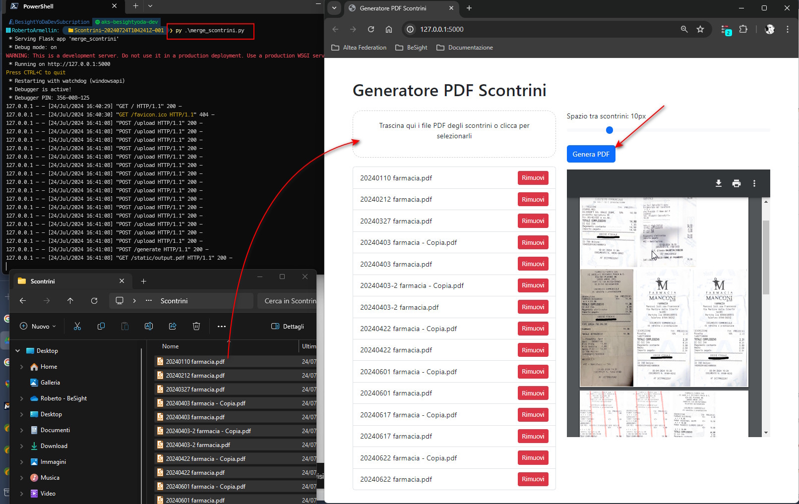

# MergeReceiptForTaxes
When filing tax returns (e.g., for 730 taxes), I sometimes have to attach copies of receipts. 
Since I take photos and archive them, the easiest thing is to merge them onto an A4 sheet, trying to optimize the space. 
This way, I keep the copies, and it’s easier to give everything to accountants or CAAF.

## Warning: this is a work in progress.
At the moment, files whose names contain “fattura” are considered to be in A4 format. 
The others are resized to a width of 76mm. 
This is because I capture the receipts with a photo (using Microsoft Lens or Google Drive), and therefore the dimensions of the receipts may vary and are not the correct ones.

In this version, I use rectpack for optimizing space.



### installig requirements
```
pip install -r requirements.txt
```

### Running 
```
py merge_scontrini.py
```

Open your browser at http://127.0.0.1:5000

Drag and drop your files, select space between recipts and click generate.

Now you can print or save your merged pdf.

